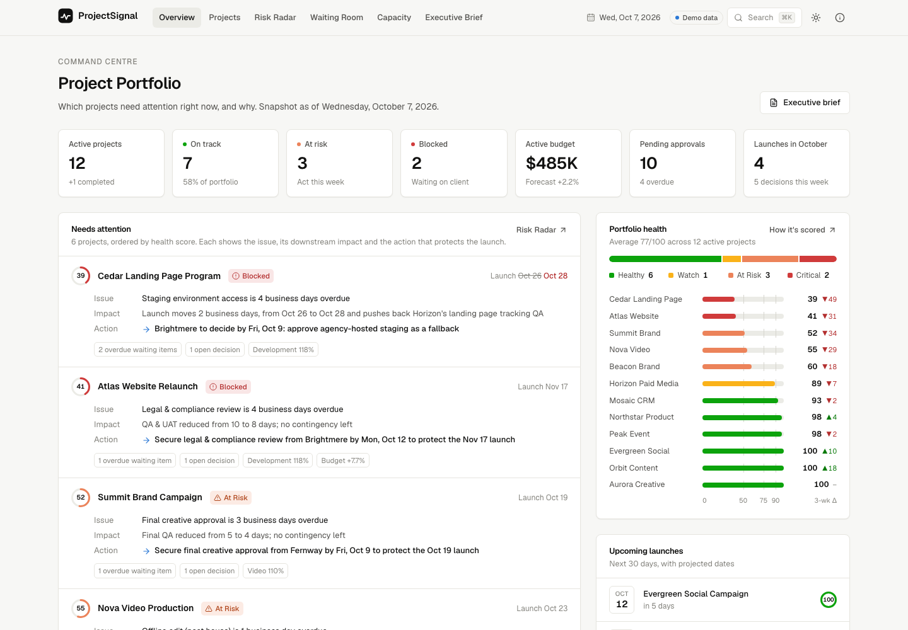
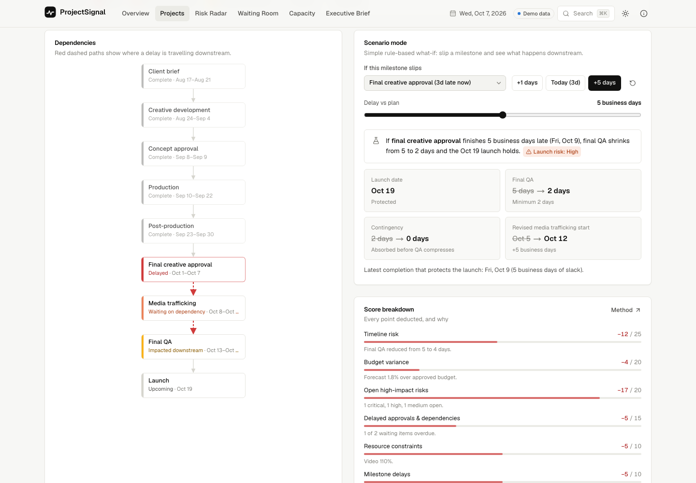
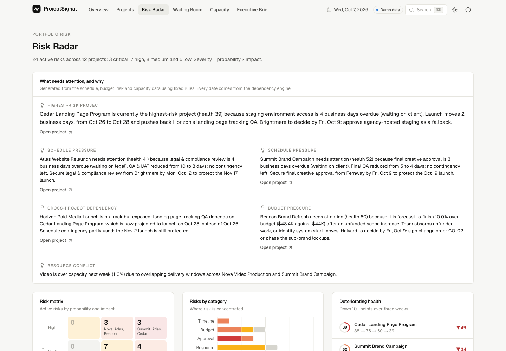
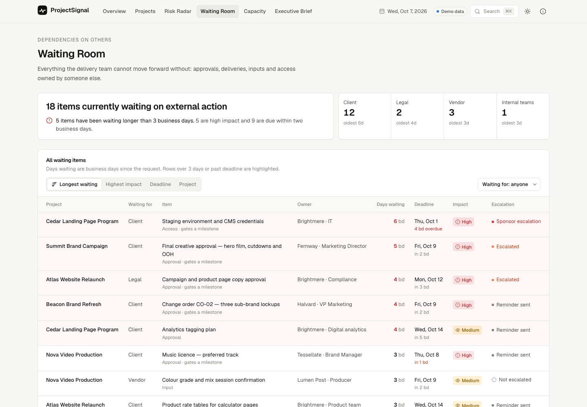
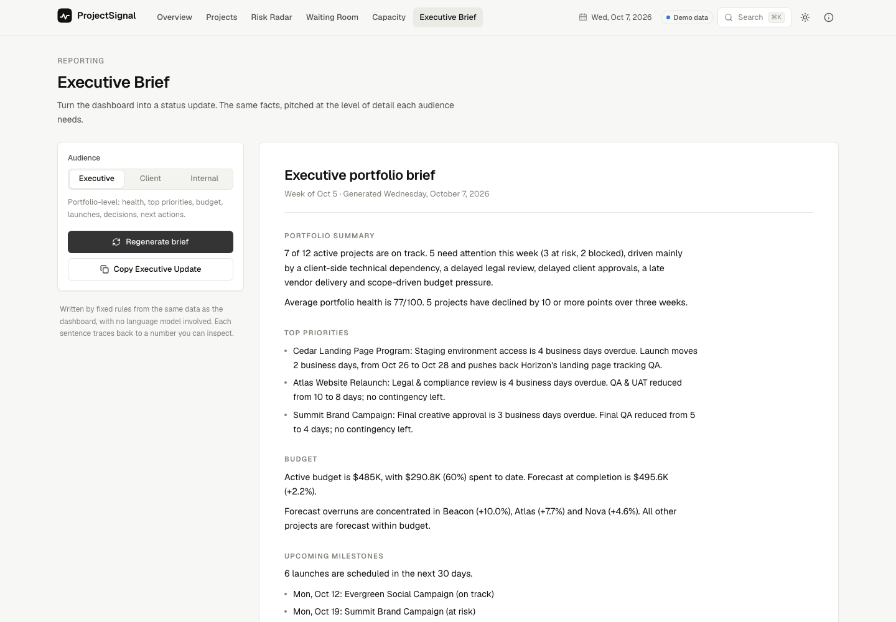
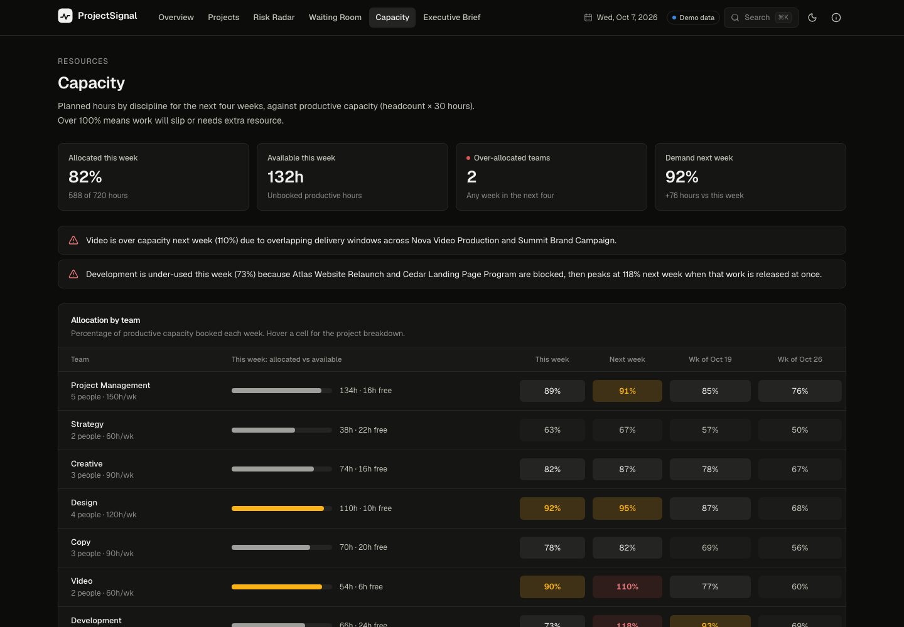

# ProjectSignal

**Live demo:** https://projectsignal-dashboard.netlify.app · [GitHub Pages mirror](https://caleb848.github.io/projectsignal/)

A project health and creative operations dashboard exploring how teams can surface risks, dependencies, approval bottlenecks, resource constraints and launch readiness.



## Overview

ProjectSignal answers one question: **which projects need a project manager's attention right now, and why?**

It models a fictional portfolio of twelve active marketing and creative projects. Launches, brand work, video, web, paid media, CRM and events are all represented. Instead of listing tasks, it follows how problems travel. A late client approval eats into contingency, then compresses QA, then moves a launch. A blocked project leaves a team idle this week and over capacity the next. The dashboard shows each step, with dates.

## Why I Built It

Most project management tools are excellent at showing what work exists. I wanted to explore a slightly different question: what does a project manager need to know to decide where attention is required?

In practice, that comes down to a few things: what is waiting on someone else, what it blocks, how much buffer is left, who is over capacity and which decisions are due. ProjectSignal is an experiment in making those visible and consistent.

## Features

| Area | What it does |
| --- | --- |
| **Overview** | Portfolio KPIs, a *Needs attention* list (issue → impact → required action), portfolio health, budget utilization, upcoming launches, approval bottlenecks and recent activity. |
| **Projects** | Table and card views with search and filters for status, type, launch month, risk level and owner. Filters are reflected in the URL. |
| **Project detail** | Summary, six health dimensions, milestone timeline (plan vs. projection), dependency graph with downstream impact, risk register, decisions required, waiting items and activity. |
| **Scenario mode** | Slip any open milestone by *n* business days and see the revised downstream dates, contingency used, QA window, launch impact and the latest date that still protects launch. |
| **Risk Radar** | Plain-language insights, a probability × impact matrix, risks by category, deteriorating projects, risks grouped by severity and recently resolved risks. |
| **Waiting Room** | Everything waiting on clients, legal, vendors or internal teams, with days waiting, deadlines, impact and escalation status. Sortable. |
| **Capacity** | Allocation by discipline over four weeks, over-allocation flags and explanations of the cause (for example, blocked work releasing all at once). |
| **Executive Brief** | Generates a status update for three audiences (Executive, Client, Internal) and copies it to the clipboard. |
| **Health score** | A transparent 0–100 score with its working shown on every project and on a methodology page. |

Also includes dark mode, a ⌘K / Ctrl+K command menu, responsive layouts, and empty and loading states.

## Product Philosophy

- **Attention, not activity.** Every surface is ranked by what needs a decision, not by what changed most recently.
- **Show the chain.** An issue is only useful with its impact and the action that resolves it. Delays are traced through dependencies to a date.
- **Leading over lagging.** Buffer used, items waiting and capacity peaks warn earlier than percent complete.
- **Transparent rules, no black boxes.** Health scores, insights and briefs come from explicit rules over the data. Nothing is presented as AI output, and every statement can be traced to a number.
- **Same facts, different altitude.** Executives, clients and delivery teams get the same truth at different levels of detail.

### How the schedule engine works

Milestones form a dependency graph. When one slips, downstream work moves in this order:

1. Plan contingency absorbs the delay first.
2. The compressible window (usually QA, with a defined minimum) shrinks next.
3. Only after both are used up does the launch date move.

The same engine drives the timeline, the dependency graph, the scenario simulator, the health score and every generated sentence.

### Health score

Each project starts at 100 and loses points for six observable signals. Each signal is capped:

| Input | Max deduction |
| --- | --- |
| Timeline risk (buffer used → QA compressed → at minimum → launch moves) | 25 |
| Budget variance (2 points per 1% forecast overrun) | 20 |
| Open high-impact risks (critical 10, high 5, medium 2) | 20 |
| Delayed approvals and dependencies (> 3 business days or past deadline) | 15 |
| Resource constraints (team > 100% this week or next) | 10 |
| Milestone delays (open milestones past due) | 10 |

The bands are: **90–100 Healthy · 75–89 Watch · 50–74 At Risk · below 50 Critical.**

## Screenshots

| | |
| --- | --- |
|  |  |
| Project detail: dependencies and scenario mode | Risk Radar |
|  |  |
| Waiting Room | Executive Brief |
|  | |
| Capacity, dark mode | |

## Tech Stack

- [Next.js 16](https://nextjs.org) (App Router) with TypeScript
- [Tailwind CSS v4](https://tailwindcss.com) with design tokens for light and dark themes
- [Lucide](https://lucide.dev) icons
- [Recharts](https://recharts.org) for the category chart; the other visualizations are lightweight HTML/SVG
- `next-themes` for dark mode
- Local, typed mock data. No backend.

## Local Setup

Requires Node.js 20 or later.

```bash
npm install
npm run dev          # http://localhost:3000
```

Other scripts:

```bash
npm run validate     # sanity-check the mock data and print every project's score
npm run lint
npm run typecheck
npm run build        # production build
```

### Deploying

The app is a fully static export (`output: "export"`), so any static host works.

- **GitHub Pages:** `npm run deploy` builds with the repo name as the base path and pushes the result to the `gh-pages` branch. Pages is set to deploy from that branch.
- **Netlify:** `npm run deploy:netlify` builds and publishes to the Netlify site (requires the Netlify CLI, logged in). `netlify.toml` also supports Git-connected builds.
- **Vercel:** import the repo. No configuration is needed.

### Project structure

```
src/
  app/                 Routes: overview, projects, projects/[id], risks, waiting, capacity, brief, scoring, about
  components/          UI grouped by area (ui, layout, charts, overview, project, projects, risks, waiting, brief)
  data/                Fictional mock data plus index.ts (the data-access layer)
  lib/
    types.ts           Domain types
    config.ts          Snapshot date, capacity weeks, thresholds
    schedule.ts        Dependency/critical-path engine and scenario analysis
    health.ts          Health score rules
    capacity.ts        Team load and conflict detection
    portfolio.ts       KPIs, "needs attention" reasoning, insights
    brief.ts           Status brief generator
scripts/validate-data.ts
```

### Editing the data

All data lives in `src/data/`. Each file holds one entity type: projects and milestones, risks, waiting items, decisions, activity and capacity. Only facts are stored. Progress, phase, milestone state, delays, health and every sentence are calculated from them.

- Milestones are listed in dependency order. Each one depends on the previous milestone unless `dependsOn` says otherwise. Mark one milestone `kind: "launch"`. Give QA-type windows a `minDays` value so they can compress.
- `SNAPSHOT_DATE` in `src/lib/config.ts` is the demo's "today". Change it and the whole portfolio recalculates.
- Run `npm run validate` after editing to catch bad ids, out-of-order dependencies or weekend dates.

To connect a real backend, replace the functions in `src/data/index.ts` with API or database calls. Components and logic read data only through that file.

## Future Ideas

- Connect to a real work-management API, with the snapshot date replaced by "now"
- Public-holiday calendars in business-day maths
- Editable scenarios that can be saved and compared side by side
- A health-score history stored per week rather than seeded
- Resource-levelling suggestions (who could absorb an overloaded team's work)
- Optional LLM-assisted drafting of briefs, grounded in the rule-based facts and clearly labelled

## Disclaimer

All organizations, projects, people, budgets, dates and scenarios represented in ProjectSignal are fictional and created solely for demonstration purposes.

Built as a personal learning experiment with Claude Code.
